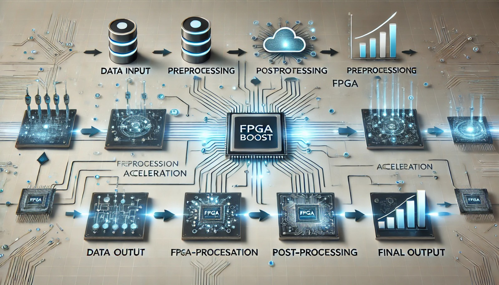

# WorkFLow-FPGA_BOOST



This guide is to keep track of the various steps required to take advantage of an FPGA as a computational accelerator. Listed below are the 5 key points of each project.

## 1. Prerequisites (Ask Mirko :D )

Per iniziare con il progetto **Workflow_FPGA_BOOST**, assicurati di avere i seguenti prerequisiti:

- **Pacchetti Software Necessari**:
  - Driver specifici per la FPGA utilizzata
  - Librerie di supporto per l'host e la piattaforma FPGA
  - Pacchetti di sviluppo per il sistema operativo ()

- **`Versione Vitis`**: È richiesto Vitis **(versione minima: X.X)**, aggiornato per supportare le ultime funzionalità di progettazione FPGA.

- **`Numero Seriale FPGA`**: Identifica il numero seriale della tua FPGA tramite gli strumenti forniti (es. `xbutil`) e assicurati che sia configurata correttamente per l'accelerazione.

> **Nota**: Verifica che il tuo ambiente sia correttamente configurato seguendo la documentazione ufficiale di Vitis e delle librerie FPGA specifiche.


## 2. Software Implementation

For each project you wish to implement, a dedicated folder it will be created with the name of the operation you intend to perform, or a name that clearly describes its purpose.

Each project folder will contain the following main files:

- **`run_hls.tcl`**:  This file is used to run the High-Level Synthesis (HLS) part of the project. It contains the bash scripts needed to synthesize the code into an FPGA-compatible format.
  
- **`testbench.cc`**: A C++ file that contains the testbench to verify the correct operation of the FPGA logic. It simulates the execution of the developed algorithm to validate the results before loading the design on the FPGA.

- **`launch.py`**:  A Python script that automates the design execution process by interfacing with the development tools to perform compilation, loading, and performance monitoring on the FPGA. Specifically, the script will allocate memory, convey data from the local to the FPGA, perform the required operations, transport the results obtained from the accelerator, and finally free memory and buffers from the hardware. 

In addition, each folder will contain a subfolder called **`src`**, which contains:

- **`func.cc`**: This file contains the C++ function implementations that will later be used in the FPGA logic implementation. And which will be called from the file **run_hls.tcl**, to fix them as top functions.

- **`func.h`**: The header file that declares the functions defined in `func.cc`, providing the necessary interfaces for their implementation in the FPGA.

This structure allows clear management of the source code of the functions to be accelerated and separates the logic of testing, configuration, and implementation in the FPGA.


## 3. Implementation of C Simulation and Software Synthesis through Vitis

**Synthesis via Vitis HLS**:
   - Once the project is ready, synthesis is started using the following command:
   
     ```bash
     vitis_hls -f run_hls.tcl
     ```
   
   - The `run_hls.tcl` file contains all the configurations needed to start the synthesis, including testbenches, the assignment of the top function that will be implemented in hardware, simulation and export comands. The `run_hls.tcl` file varies from project to project, depending on the operation to be developed, but retains some common elements, such as the target board.

> **Nota**: The file `run_hls.tcl` is used to automate processes. To have more control over what is done, you can run each command individually via bash.

## 4. Compiling as Binary Image

To compile the project as a binary image to be uploaded to the FPGA, you need to run the following bash command:

```bash
v++ -l -t hw --platform xilinx_u55c_gen3x16_xdma_3_202210_1 -o nomefile.xclbin ./path/filexport.xo
```
The command compiles a hardware project intended to run on a specific FPGA platform. Specifically, we are creating a single binary file (**`filename.xclbin`**), which will be loaded onto the hardware platform.

## 5. Injection bitstream in FPGA

Once the **`.xclbin`** file has been created, it will be possible to use it by running the python script **`launch.py`**. 
Generally the file is used to allow interaction between the FPGA and CPU, and use the FPGA as a computational accelerator.
The following are the main steps:
  - Imports the libraries necessary for communication with the FPGA.
  - Performs the loading of the FPGA overlay.
  - Manages the memory usage of the FPGA.
  - Performs the desired operation on both CPU and FPGA and compares the timings. 
  - Collects the results provided by the accelerator.  
  - Verifies that the results are equal.
  - Hardware release.
